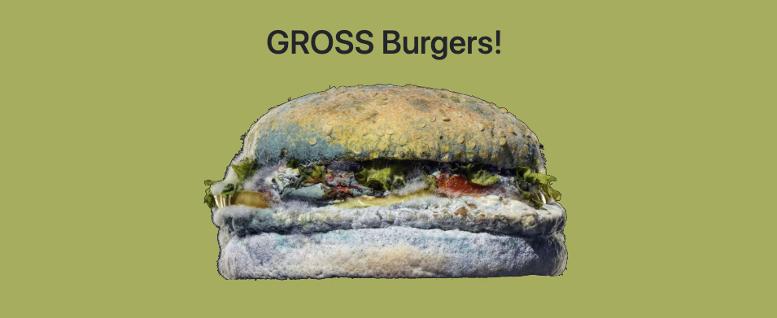
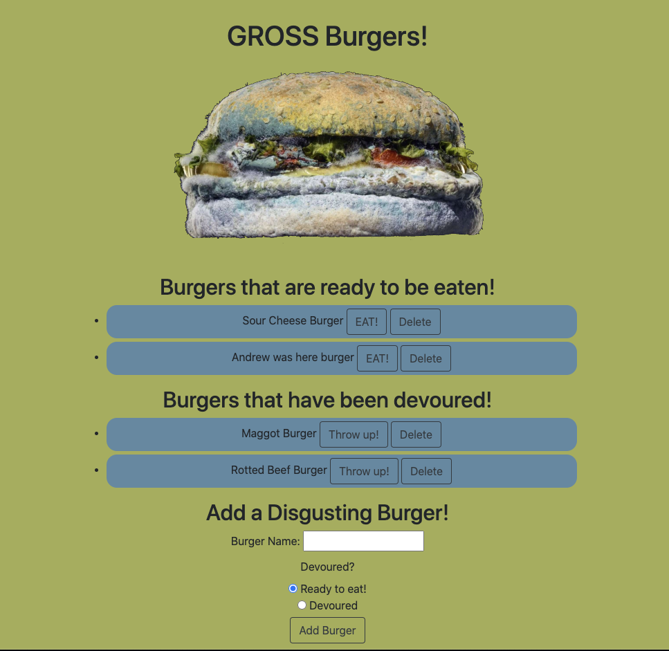
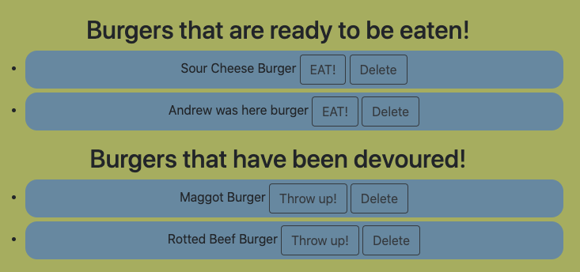
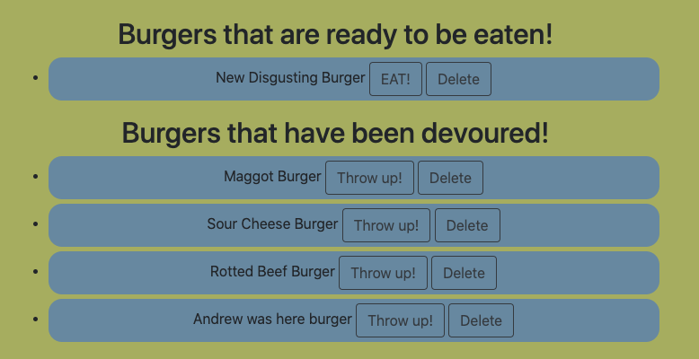
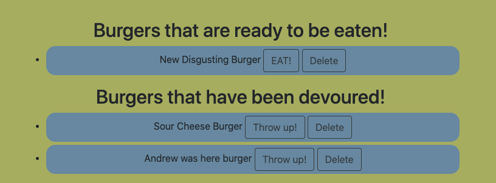

# Gross Burger Builder!

[GROSS Burgers!](https://gross-burger.herokuapp.com/)

## Description

This application allows the user name the most disgusting burger they can come up with and then move it between a ready to be eaten and devoured list.

## Usage

Upon navigation to this page, the user will be presented with a list of existing burgers that are waiting to be eaten and a list that has been devoured and are waiting to be thrown up.

Located toward the bottom of the page, the user will then find an input to submit their own Gross Burger and decide which list it will be submitted on.

After submitting their burger, it will populate one of the two lists in the center of the page.

The burgers on the lists can then be eaten or thrown up depending on the list their respective list.

The user can also remove a burger from the page entirely by clicking the delete button.

## Creating This Page

For this project, I built a database using MySql and then built a website using Handlebars to generate the HTML. The main challenge for this site came from setting up connection queries using ORMs and navigating the directory of separated files. The file interaction was fascinating and confusing trying to remember what information was stored where and setting up all of the page connections making sure they were exporting and requiring properly. The ORMs gave me a lot of trouble in how the different writing methods relayed information and when to use what writing style when I needed strings, numbers, or booleans. This was a very confusing and challenging project.

## Contributions

When contributing to this repository, please contact the owner of the repository before pushing any updates.
When contributions are accepted, please update the readme.md noting any changes that have been made.

## Authors and Acknowledgment

All files for this project were adapted and written by Raleigh Chesney based on files provided by GA Tech Coding Boot Camp.

NPMs:
* [Express](https://www.npmjs.com/package/express)
* [MySql](https://www.npmjs.com/package/mysql)
* [Handlebars](https://www.npmjs.com/package/handlebars)

Hosting:
* [Heroku](https://www.heroku.com/home)
* [JawsDB](https://www.jawsdb.com/)

Web Dev Tools:
* [Mozille Developer Network](https://developer.mozilla.org/en-US/)
* [Stack Overflow](https://stackoverflow.com/)
* [w3schools!](https://www.w3schools.com/bootstrap4/default.asp)

Thank you to all of my GT Bootcamp classmates who have offered advice and helped fix bugs alone the way.

## License

MIT License

Copyright (c) 2020 Raleigh Chesney

Permission is hereby granted, free of charge, to any person obtaining a copy
of this software and associated documentation files (the "Software"), to deal
in the Software without restriction, including without limitation the rights
to use, copy, modify, merge, publish, distribute, sublicense, and/or sell
copies of the Software, and to permit persons to whom the Software is
furnished to do so, subject to the following conditions:

The above copyright notice and this permission notice shall be included in all
copies or substantial portions of the Software.

THE SOFTWARE IS PROVIDED "AS IS", WITHOUT WARRANTY OF ANY KIND, EXPRESS OR
IMPLIED, INCLUDING BUT NOT LIMITED TO THE WARRANTIES OF MERCHANTABILITY,
FITNESS FOR A PARTICULAR PURPOSE AND NONINFRINGEMENT. IN NO EVENT SHALL THE
AUTHORS OR COPYRIGHT HOLDERS BE LIABLE FOR ANY CLAIM, DAMAGES OR OTHER
LIABILITY, WHETHER IN AN ACTION OF CONTRACT, TORT OR OTHERWISE, ARISING FROM,
OUT OF OR IN CONNECTION WITH THE SOFTWARE OR THE USE OR OTHER DEALINGS IN THE
SOFTWARE.

